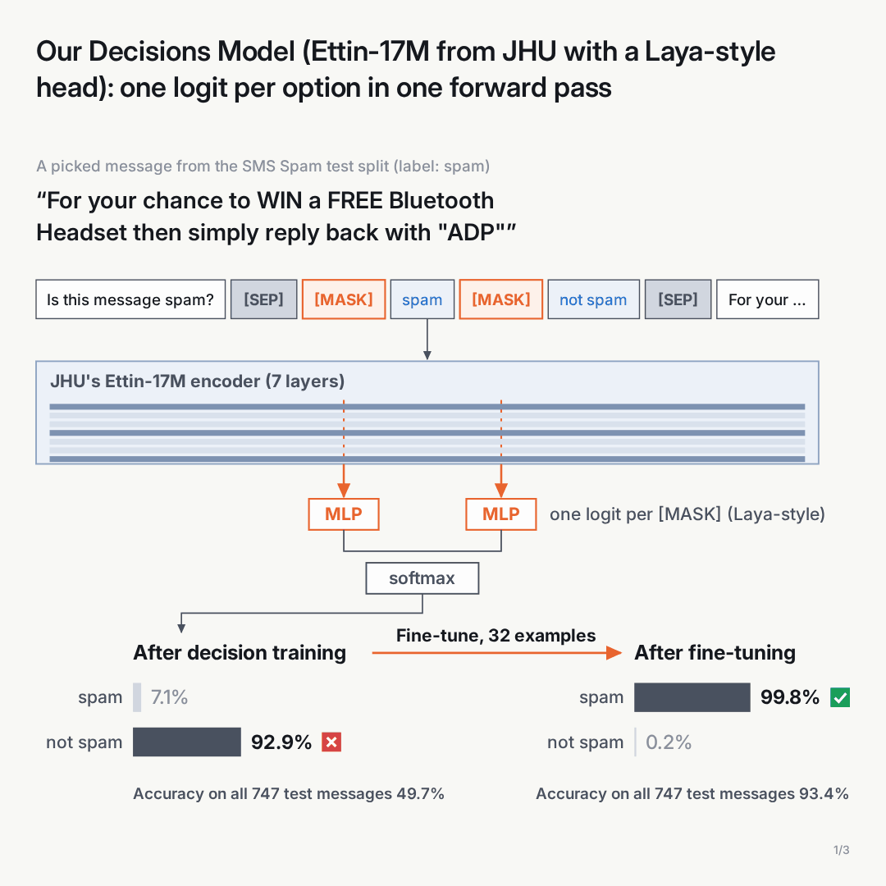
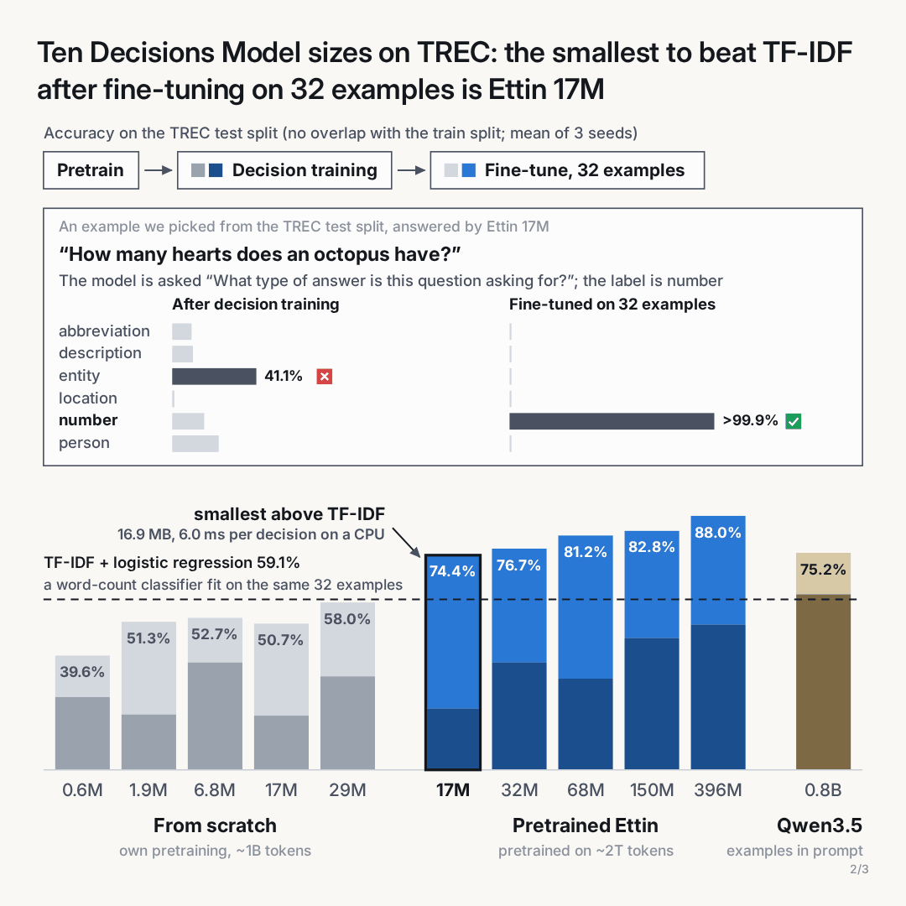
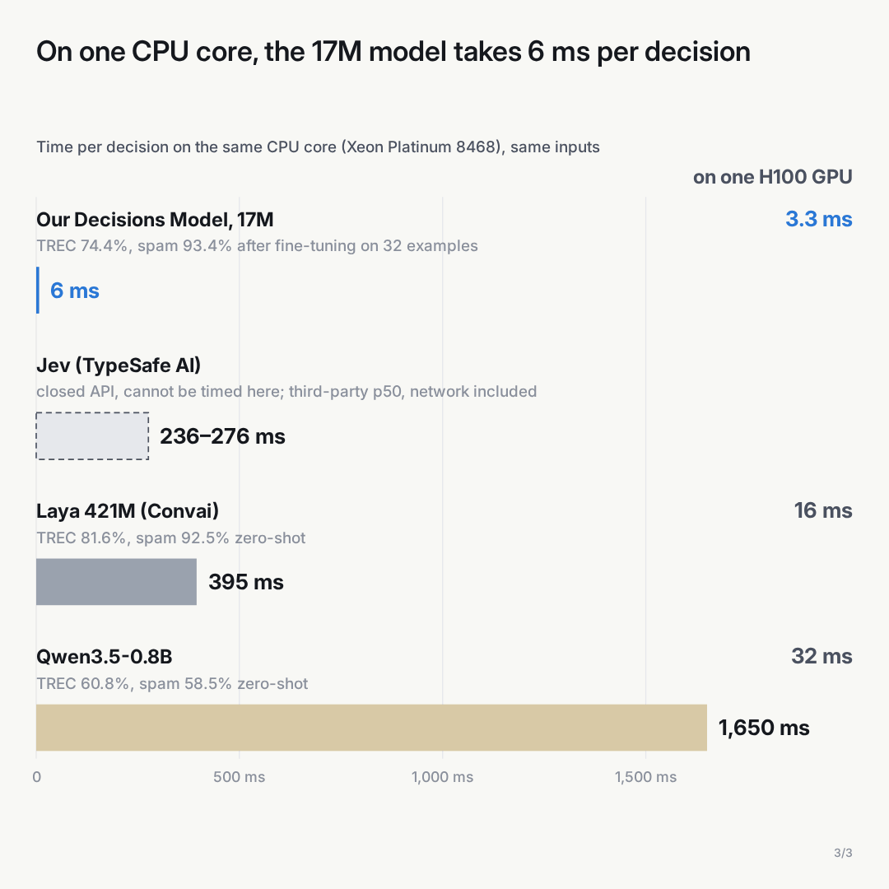

# How small can a Decisions Model be?

**A Decisions Model reads a question, its allowed answers and a text, and returns one answer with a probability in one forward pass. How small, and how fast on a CPU, can one be?**

Jev (TypeSafe AI, closed API), [Laya](https://huggingface.co/convaiinnovations/laya) (Convai, 421M) and [Bekko System One v0](https://huggingface.co/hotchpotch/bekko-system-one-v0-17m) (hotchpotch, 17M–400M) are this year's Decisions Models. We use Laya's scoring (a `[MASK]` before each answer, softmax over the markers) at ten sizes:

- **from scratch**, 0.6M–29M: our 8K BPE tokenizer, masked-word pretraining on ~1B tokens of FineWeb-Edu;
- **from JHU's [Ettin](https://huggingface.co/jhu-clsp/ettin-encoder-17m)**, 17M–400M, pretrained on ~2T tokens.

All ten get the same decision training (466,344 decisions: 23 public tasks plus ones written by Qwen3.5-9B) and are tested on 5 held-out tasks, with no examples and after fine-tuning on 8 or 32. The baseline is TF-IDF (word 1–2-grams, character 2–5-grams) + logistic regression (C = 10), trained on the same examples; it reads only the text and can only give answers it saw.

<p>
  
  
  
</p>

## Result

TREC (6 question types), accuracy on the 250-question test split, %, mean of 3 draws of examples from the train split:

| model | params | no examples | 8 examples | 32 examples |
|---|---:|---:|---:|---:|
| from scratch | 0.6M | 25.2 | 27.1 | 39.6 |
| from scratch | 29M | 32.4 | 37.2 | 58.0 |
| Ettin start | 17M | 21.2 | 46.8 | **74.4** |
| Ettin start | 400M | 50.4 | 72.0 | 88.0 |
| TF-IDF + logistic regression | – | – | 37.6 | 59.1 |
| Qwen3.5-0.8B, examples in its prompt | 0.8B | 60.8 | 65.9 | 75.2 |
| Laya | 421M | 81.6 | | |
| Bekko System One v0 (never trained on TREC) | 17M | 46.4 | | |

SMS spam, accuracy on the 747-message test split, %:

| model | no examples | 8 examples | 32 examples |
|---|---:|---:|---:|
| Ettin start, 17M | 49.7 | 78.7 | **93.4** |
| TF-IDF + logistic regression | – | 61.7 | 86.5 |
| Qwen3.5-0.8B, examples in its prompt | 58.5 | 61.8 | 79.3 |
| Laya | 92.5 | | |

Time per decision, ms (same 5-option decisions, batch 1, median):

| model | one CPU core (Xeon Platinum 8468) | one H100 |
|---|---:|---:|
| Ettin start, 17M | **6.0** | **3.3** |
| Laya, 421M | 395 | 15.8 |
| Qwen3.5-0.8B | 1,650 | 31.5 |
| Bekko System One v0, 17M | 14.7 | – |

On the GPU, ours and Laya run in eager PyTorch and Qwen3.5-0.8B in vLLM. Jev is a closed API and is not timed.

- After 32 examples, Ettin 17M (16.9 MB at 8 bits) beats TF-IDF on both tasks, ties Qwen3.5-0.8B on TREC and beats it on spam. No from-scratch size beats TF-IDF on TREC.
- With no examples, none of ours is close: the best, Ettin 400M, averages 60.7% over the 5 tasks against 78.5% for Qwen3.5-9B.
- The speed gap is a CPU result: on an H100 the 17M takes 3.3 ms against 15.8 ms for Laya.
- Every score is on the test split; on their own examples the models score 100%. No TREC test question has a near-copy in the train split, and dropping the 80 spam test messages that have one moves the 17M from 93.4% to 92.9%.

All tables and run details: [runs/results.md](runs/results.md).

## Reproduce

```bash
uv sync
uv run python -m tiny_decisions report   # the tables from the saved results in runs/ (no GPU)
```

From scratch, on one GPU (`CUDA_VISIBLE_DEVICES`, default 2):

```bash
bash scripts/get_data.sh        # tasks, tokenizer, web text, model weights
bash scripts/run_scratch.sh     # 0.6M–29M: pretraining, decision training, fine-tuning
bash scripts/run_ettin.sh       # Ettin 17M–400M: decision training, fine-tuning
bash scripts/run_baselines.sh   # TF-IDF, Qwen3.5, Laya, Bekko
bash scripts/run_checks.sh      # overlap check, 8-bit size, timing, tables
```

Code: `tiny_decisions/`, one module per step (`uv run python -m tiny_decisions --help`). Limits: English only, 5 held-out tasks, one training run per size.
